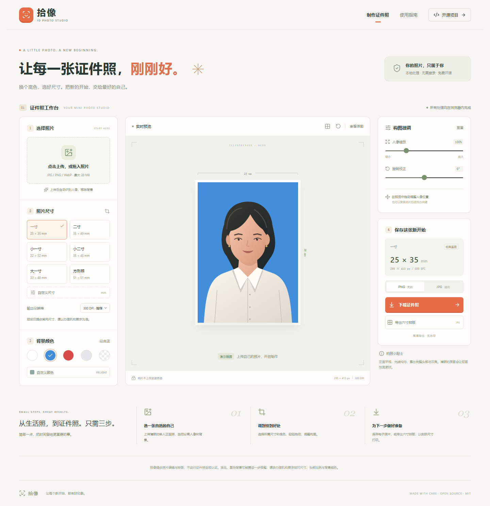

# ID Photo Studio · 拾像

A local, privacy-first ID photo editor built with React, TypeScript, MediaPipe and Canvas.

[中文文档](README.md) · [Contributing](CONTRIBUTING.md) · [License](LICENSE)



## Features

- On-device portrait background removal. White, blue, red, gray, custom and transparent backgrounds.
- Six common size presets and custom 10–100 mm dimensions; 150, 300 or 600 DPI.
- Drag, zoom, rotation correction, composition guides and original-image comparison.
- Source-quality output keeps all effective crop pixels by default. PNG is lossless, JPEG uses maximum browser quality; fixed 150/300/600 DPI remains available.
- 6 × 4 inch print sheets with margins, spacing, cutting guides and orientation selection.
- No account, API key, photo upload, analytics or server-side inference.
- Responsive Chinese interface with keyboard controls.

The initial portrait is an original **demo illustration**, not a demonstration of model quality. Uploading a normal photo invokes segmentation; images with an existing transparent background can skip it.

## Run locally

Node.js 22.12+ required; Node 24 LTS suggested.

```bash
git clone https://github.com/changan-525/ID-Photo-Studio.git
cd ID-Photo-Studio
npm install
npm run dev
```

Startup verifies the included, version-pinned 250 KB model and copies WASM resources from the installed package. Missing or invalid model files are downloaded from Google's official versioned URL and SHA-256 verified. Runtime assets are served from your own origin; photos stay in memory. There is no service worker or guaranteed offline cache. After dependency installation, a local server can run without internet.

```bash
npm run check
npm test
npm run build
npm run preview
```

Serve through HTTP(S), not `file://`. Keep the entire `dist/` directory together when deploying.

## Browser tests

```bash
npx playwright install chromium
npm run test:e2e
```

Five tests run by default. The sixth, actual portrait segmentation test runs when `PORTRAIT_FIXTURE` points to your own local portrait. Set `PLAYWRIGHT_CHANNEL=chrome` to use an installed Chrome instead of Playwright's browser. Tests cover source-pixel retention, exports, metadata, dimensions, background pixels, print sheets, error recovery, mobile overflow and keyboard editing. The optional model test also verifies that runtime requests remain same-origin.

## GitHub and deployment

Source repository: [changan-525/ID-Photo-Studio](https://github.com/changan-525/ID-Photo-Studio). Stars, forks, issues and pull requests are welcome. If you downloaded a ZIP, run `npm install` and `npm run dev` in the extracted project directory without cloning.

For GitHub Pages, select **Settings → Pages → Source → GitHub Actions**, then manually run **Actions → Deploy GitHub Pages**. The workflow builds and deploys the static site. Relative asset paths support repository subpaths. Normal pushes and pull requests only run CI. Follow the [official Pages workflow documentation](https://docs.github.com/en/pages/getting-started-with-github-pages/using-custom-workflows-with-github-pages) for repository configuration.

## Technical notes

`src/lib/segmentation.ts` loads the local MediaPipe SelfieSegmenter square float16 v1. `photo.ts` handles decoding, crop composition and print sheets. `dpi.ts` writes physical density metadata without copying original EXIF/GPS.

The one-inch preset is 25 × 35 mm: `round(mm / 25.4 × DPI)` gives 295 × 413 px at 300 DPI. Preset names and measurements are shortcuts, not certification of any issuing authority's requirements. Print sheets use 152.4 × 101.6 mm paper, 3 mm margins and 2 mm gaps. Print at actual size / 100%, with fit-to-page disabled.

Inputs: JPG, PNG or WebP, up to 50 MB and 40 megapixels; HEIC is unsupported. Images are decoded with browser EXIF orientation support and retain their source pixel dimensions. Source-quality mode chooses the largest target-aspect canvas that does not upscale effective source pixels and writes the resulting DPI. PNG is lossless and preserves transparency; JPEG is always lossy even at the maximum quality setting and flattens transparency onto white. Six-inch sheets are capped at 600 DPI to avoid excessive print files. Processing happens in the main thread and can briefly block low-powered devices; cancel discards pending results but cannot stop a synchronous inference already running.

Changing a background or crop necessarily re-encodes the image, so the output cannot be byte-for-byte identical to the upload. “Lossless” means the PNG encoder introduces no additional lossy compression; segmentation edge quality is still limited by the lightweight mask model.

This is lightweight segmentation, not professional alpha matting. Hair, accessories and complex backgrounds may need manual touch-up in another editor. It does not identify people, validate official ID rules, automatically enforce head proportions, or compress to a target file size. Chrome has been tested; other browsers need Canvas, WebAssembly and `createImageBitmap` support.

## License

Original application code and demo illustration: [MIT](LICENSE). MediaPipe and its portrait model: Apache-2.0. See [third-party notices](THIRD_PARTY_NOTICES.md) and the [official model card](https://storage.googleapis.com/mediapipe-assets/Model%20Card%20MediaPipe%20Selfie%20Segmentation.pdf).
